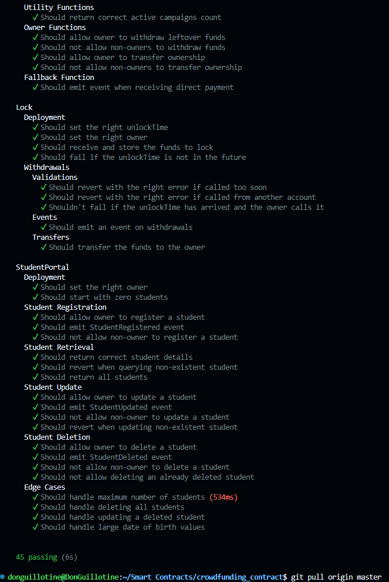

# Crowdfunding Platform

This is a decentralized crowdfunding platform built using Solidity for the smart contract and React.js for the front-end. The platform allows users to create, manage, and contribute to crowdfunding campaigns on the Ethereum blockchain.

## Table of Contents

- [Features](#features)
- [Prerequisites](#prerequisites)
- [Getting Started](#getting-started)
  - [Smart Contract Deployment](#smart-contract-deployment)
  - [Front-End Setup](#front-end-setup)
- [Usage](#usage)
  - [Create a Campaign](#create-a-campaign)
  - [Donate to a Campaign](#donate-to-a-campaign)
  - [End a Campaign](#end-a-campaign)
- [Tests](#tests)
- [Technologies Used](#technologies-used)
- [Contributing](#contributing)
- [License](#license)

## Features

- **Create Campaigns**: Users can create crowdfunding campaigns by providing a title, description, goal amount, and duration.
- **Donate**: Users can donate Ether to active campaigns.
- **Campaign Management**: Campaign creators can end campaigns once the goal is reached or the campaign duration is over.
- **View Campaigns**: Users can view all active campaigns along with details like the amount raised, goal, and deadline.

## Prerequisites

Before you begin, ensure you have the following installed:

- [Node.js](https://nodejs.org/)
- [npm](https://www.npmjs.com/) or [yarn](https://yarnpkg.com/)
- [MetaMask](https://metamask.io/) browser extension

## Getting Started

### Smart Contract Deployment

1. **Clone the repository**:

    ```bash
    git clone https://github.com/DonGuillotine/crowdfunding-smart-contract.git
    cd crowdfunding-platform
    ```

2. **Install Hardhat and dependencies**:

    ```bash
    npm install --save-dev hardhat
    ```

3. **Compile the Smart Contract**:

    ```bash
    npx hardhat compile
    ```

4. **Deploy the Smart Contract**:

    Edit the deployment script to deploy the `CrowdfundingPlatform` contract:

    Then deploy:

    ```bash
    npx hardhat run scripts/deploy.js --network your-network
    ```

5. **Copy the Contract Address and ABI**:

    After deploying, copy the contract address and update the front-end configuration in `ContractInteraction.js`.

    Copy the ABI from the `artifacts` directory into `src/CrowdfundingPlatform.json`.

### Front-End Setup

1. **Navigate to the `frontend` directory**:

    ```bash
    cd crowdfunding-frontend
    ```

2. **Install front-end dependencies**:

    ```bash
    npm install
    ```

3. **Start the React app**:

    ```bash
    npm start
    ```

    The app should be running on [http://localhost:3000](http://localhost:3000).

## Usage

### Create a Campaign

1. Navigate to the "Create a New Campaign" section on the homepage.
2. Fill out the form with the campaign title, description, benefactor address, goal amount, and duration in seconds.
3. Click "Create Campaign" to deploy the campaign to the blockchain.

### Donate to a Campaign

1. Scroll down to view the list of active campaigns.
2. Select the campaign you want to donate to.
3. Enter the amount of Ether you wish to donate and click "Donate".

### End a Campaign

1. If you're the campaign creator and the goal has been reached or the duration has ended, you can end the campaign.
2. Click the "End Campaign" button to transfer the raised funds to the benefactor.

### Tests



## Technologies Used

- **Solidity**: Smart contract development.
- **Hardhat**: Ethereum development environment.
- **React.js**: Front-end framework.
- **Ethers.js**: Library for interacting with the Ethereum blockchain.
- **MetaMask**: Ethereum wallet and browser extension.

## Contributing

Contributions are welcome! Please feel free to submit a Pull Request or open an Issue for any bugs, improvements, or features.

1. Fork the repository.
2. Create your feature branch (`git checkout -b feature/AmazingFeature`).
3. Commit your changes (`git commit -m 'Add some AmazingFeature'`).
4. Push to the branch (`git push origin feature/AmazingFeature`).
5. Open a Pull Request.

## License

This project is licensed under the MIT License.
